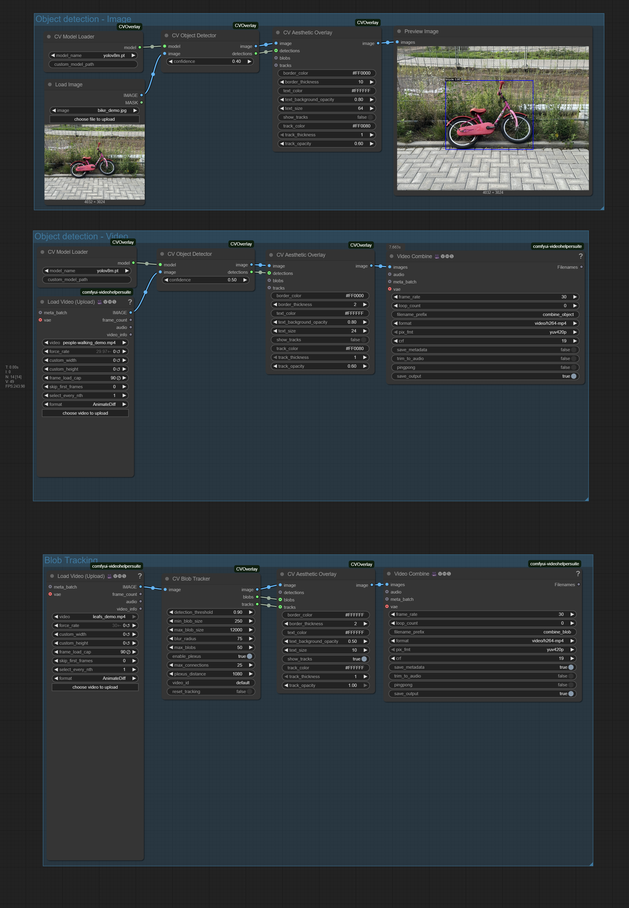

# ComfyUI-CVOverlay

Bring TouchDesigner's blob tracking aesthetics into ComfyUI. A small helper suite for adding computer vision effects to your image and video workflows.



## What it does

This brings some popular TouchDesigner visual techniques into ComfyUI for quick experimentation and integration into existing workflows.

**Key Features:**
- Bright spot detection with stable tracking
- Plexus-style connections between tracked elements
- Video batch processing that works with VHS nodes
- YOLOv8 object detection with automatic model management
- Simple art direction controls for styling

## Nodes (4 total)

### CV Model Loader
Downloads and manages YOLOv8 models automatically to `ComfyUI/models/yolo/`

### CV Object Detector  
Standard object detection - returns data without visualization

### CV Blob Tracker
TouchDesigner-style blob tracking focused on bright spots:
- `detection_threshold` - Sensitivity (lower = more sensitive)
- `min_blob_size` / `max_blob_size` - Size filtering  
- `blur_radius` - Stability control (higher = extends tracking borders, reduces noise)
- `enable_plexus` - Connection lines between nearby blobs
- `max_connections` - Limit plexus complexity

### CV Aesthetic Overlay
Unified technical visualization:
- Corner brackets and crosshairs
- Customizable colors and typography
- Track lines and trajectory trails
- Clean integration with ComfyUI's image/video pipeline

## Basic Workflow

**Images:**
```
Load Image → CV Object Detector → CV Aesthetic Overlay → Preview
```

**Videos:**
```
VHS Load Video → CV Blob Tracker → CV Aesthetic Overlay → VHS Video Combine
```

Works with standard ComfyUI nodes - no special setup required.

## Installation

```bash
cd ComfyUI/custom_nodes
git clone https://github.com/joosthel/ComfyUI-CVOverlay.git
```

Restart ComfyUI. Dependencies install automatically, models download on first use.

## Use Cases

- Motion graphics - Add tracking data to existing video workflows
- Technical aesthetics - Clean visual styling for detected elements
- Data visualization - Highlight movement and objects in footage
- Creative experiments - TouchDesigner-style effects without leaving ComfyUI

## Notes

This is a focused tool suite, not a comprehensive CV solution. Built for creators who want TouchDesigner's signature look in their ComfyUI workflows without complexity.

This is just a small test to get the effects into ComfyUI. If you want any features, just shoot me a message at mail@joosthelfers.com.

Licensed under MIT.
